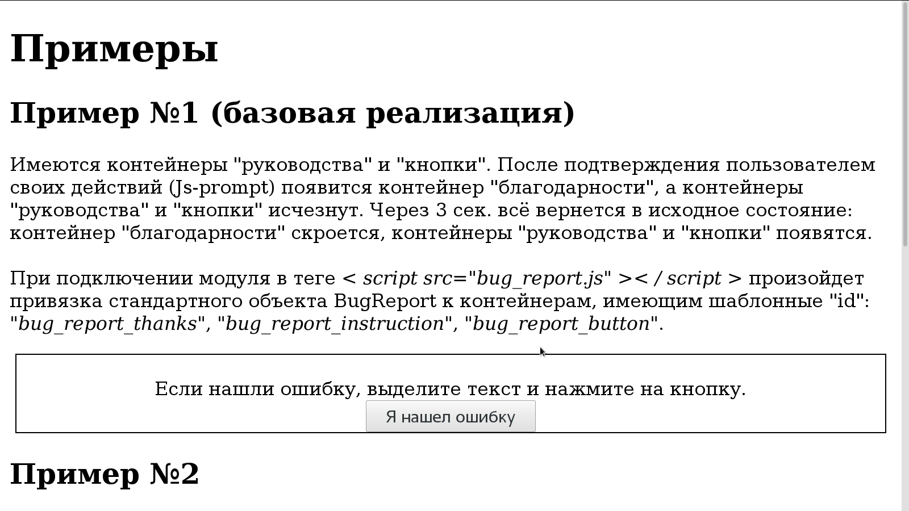
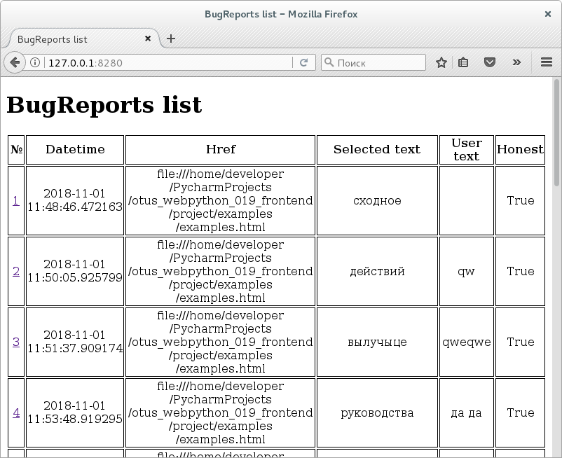

# BugReport (frontend)

Фронтэнд для [быстро скомпанованного бэкэнда](https://github.com/BorisPlus/otus_webpython_019_backend).

### Проверка работоспособности

Запутитсе бэкэнд.

Откройте проектный пример фронтэнда <a href="https://github.com/BorisPlus/otus_webpython_019_backend/blob/master/project/examples/examples.html" target="_blank">examples.html</a>.

Поведение идентично изначальному, см. GIF-анимацию:

<kbd></kbd>

Если бэкэнд не отработает, то появится JS-ALERT.

На бэкэнде появятся записи.

Подробная информация

## Авторы

* **BorisPlus** - [https://github.com/BorisPlus/otus_webpython_018](https://github.com/BorisPlus/otus_webpython_018)

## Лицензия

Свободно

## Дополнительные сведения

Проект в рамках домашнего задания курса "Web-разработчик на Python" на https://otus.ru/learning
