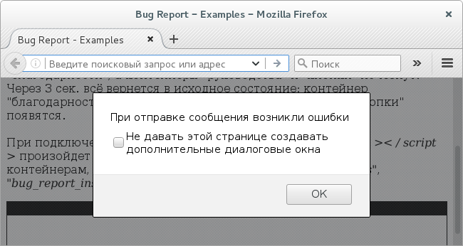
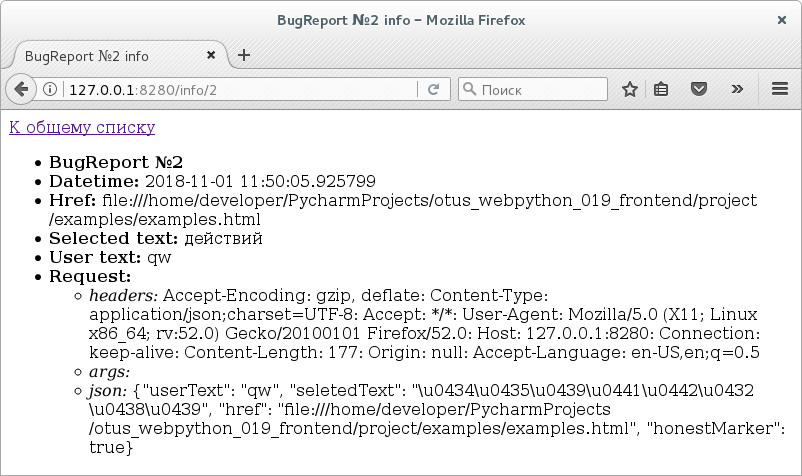

# BugReport (frontend)

Фронтэнд для [быстро скомпанованного бэкэнда](https://github.com/BorisPlus/otus_webpython_019_backend).

Этапы:
* идея пректа [BugReport (NATIVE JS)](https://github.com/BorisPlus/BugReport_NATIVE_JS)
* развитие [Webpacked BugReport](https://github.com/BorisPlus/otus_webpython_018)
* после рефакторинга [BugReport](https://github.com/BorisPlus/otus_webpython_019_frontend)

### Варианты сборок

```bash
npm start
npm run prod
npm run dev
npm run debug
```

### Проверка работоспособности

Запутитсе бэкэнд.

Откройте проектный пример фронтэнда <a href="https://github.com/BorisPlus/otus_webpython_019_frontend/blob/master/project/examples/base_example/base_example.html" target="_blank">base_example.html</a>.

Поведение идентично изначальному.

Но если бэкэнд не отработает, то появится JS-ALERT.



На бэкэнде появятся записи.


Подробная информация



## Авторы

* **BorisPlus** - [https://github.com/BorisPlus/otus_webpython_019_frontend](https://github.com/BorisPlus/otus_webpython_019_frontend)

## Лицензия

Свободно

## Дополнительные сведения

Проект в рамках домашнего задания курса "Web-разработчик на Python" на https://otus.ru/learning
